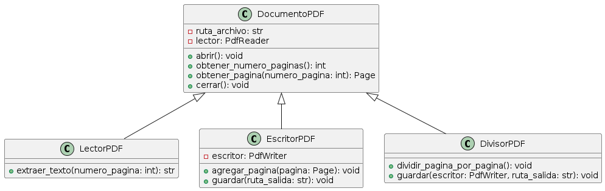

# PyPDF2 Application Grupo 20 Comisión 1 

## Descripción

Este proyecto muestra cómo usar la biblioteca PyPDF2 para manipular archivos PDF en Python. La aplicación se divide en tres archivos principales utilizando clases y herencia para una mejor organización del código.

## PyPDF2

PyPDF2 es una biblioteca pura de Python que permite realizar operaciones comunes con archivos PDF como:
- Leer y extraer texto de PDFs.
- Fusionar múltiples archivos PDF en uno solo.
- Manipular páginas de PDFs (rotar, recortar, etc.).

  ### Diagrama UML de clases



### Instalación

Para instalar PyPDF2, usa el siguiente comando:

```bash
pip install pypdf2

```
####Para probar el proyecto una vez clonado e instalado todo lo necesario escribir por consola:
python main.py extraer_texto ejemplo.pdf salida_texto.txt
python main.py unir_pdfs ejemplo.pdf salida.pdf salida_unido.pdf
python main.py dividir_pdf salida.pdf


